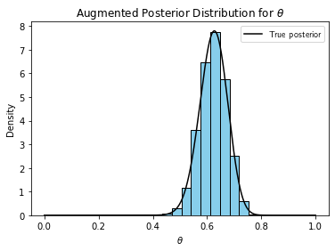
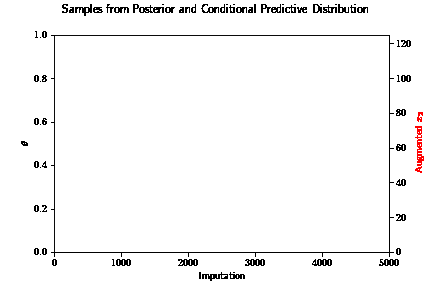
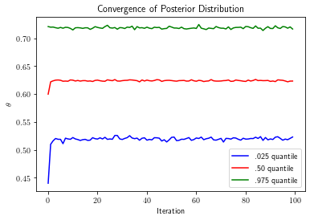
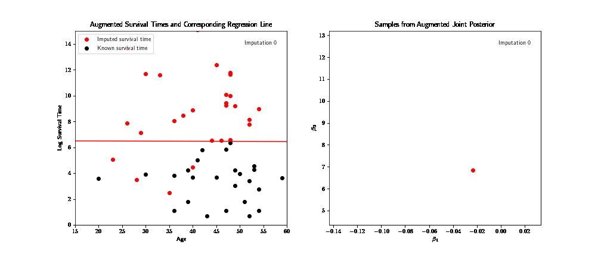
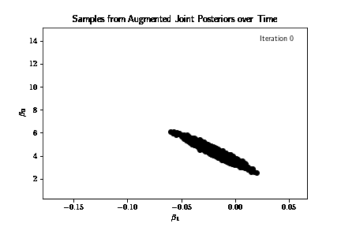
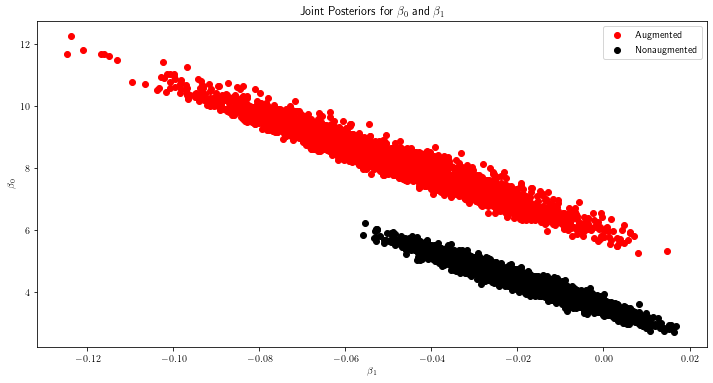
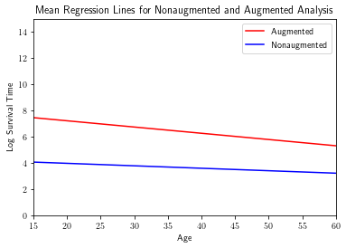
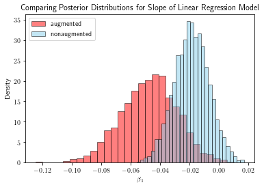
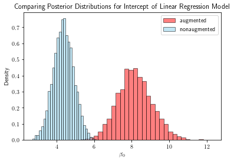
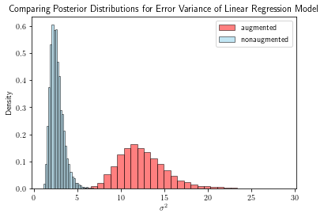

# Data augmentation

The data augmentation algorithm serves two purposes: (1) to simplify an intractable or unwieldy posterior, or (2) better approximate the posterior when we have partially missing data. I demonstrate both purposes below using real examples. But first, I briefly motivate the algorithm (both examples and explanation are adapted from Tanner, 1996).

As explained above, sometimes the analytical form of the posterior $p(\theta | Y)$ might be too complex to compute expectations over, or even sample. Or, we might want to incorporate as much information as possible into the posterior from only partially observed data. In both scenarios, we augment the observed data $Y$ with latent variables $Z$. We take advantage of a tractable augmented posterior $p(\theta | Y, Z)$ to recover $p(\theta | Y)$. Note that if $p(\theta | Y, Z)$ is too complex to work with, we are stuck again. Assuming we can evaluate or sample $p(\theta | Y, Z)$, we can integrate $Z$ out to get $p(\theta | Y)$. We have $$p(\theta | Y) = \int_{Z} p(\theta | Y, Z)p(Z | Y) dZ.$$ We call this the posterior identity. But in order to evaluate the posterior identity and recover $p(\theta | Y)$, we need the form of $p(Z | Y)$. We can write $$p(Z | Y) = \int_{\theta} p(Z | Y, \theta)p(\theta | Y)d\theta.$$ This is the predictive identity. Note that $p(Z | Y)$ depends on $p(\theta | Y)$, and $p(\theta | Y)$ in turn depends on $p(Z | Y)$. Thus, starting at an initial approximation to $p(\theta | Y)$, we can alternate between sampling latent variables $Z$ using the predictive identity, and sampling $\theta$ using the posterior identity. This way, we iteratively improve our approximation to $p(\theta | Y)$. The algorithm works as follows:

(1) Sample $\theta_{1}^{\ast}$, ..., $\theta_{m}^{\ast}$ from the current approximation to the nonaugmented posterior $p(\theta | Y).$  
(2) Sample $z_j$ from the conditional predictive distribution $p(Z | \theta_{j}^{\ast}, Y)$ for each $j = 1, ..., m$.  
(3) Update $p(\theta | Y)$ as the mixture of augmented posteriors so that $p(\theta | Y)$ = $\frac{1}{m}$ $\sum\limits_{j=1}^{m} p(\theta | z_j, Y)$.  
(4) Repeat steps (1)-(3) until the approximation converges to $p(\theta | Y)$. 

To be clear, at each iteration of the algorithm, we generate $m$ latent variables $Z$. Each $z_j$ for $j = 1, ..., m$ corresponds to an augmented posterior, from which we generate a corresponding $\theta_{j}^{\ast}$. The approximation to the nonaugmented posterior we wish to recover is the mixture of these augmented posteriors. Meaning, our approximation is represented by $\theta_{1}^{\ast}$, ..., $\theta_{m}^{\ast}$, where each $\theta_{j}^{\ast}$ potentially comes from a different augmented posterior distribution. We demonstrate this process concretely below. 

## Simplifying the form of a posterior

We consider the genetic linkage model. Suppose 197 animals are distributed into four categories as follows: $$Y = (y_{1}, y_{2}, y_{3}, y_{4}) = (125, 18, 20, 34)$$ with cell probabilities $$(\frac{1}{2} + \frac{\theta}{4}, \frac{1 - \theta}{4}, \frac{1 - \theta}{4}, \frac{\theta}{4}).$$ Under a flat prior, the posterior distribution is $$p(\theta | Y) \propto (2 + \theta)^{y_{1}}(1 - \theta)^{y_{2} + y_{3}}\theta^{y_4}.$$ Evaluating expectations of this function might be too complex for our liking. Alternatively, as Monte Carlo enthusiasts, we could sample the distribution instead. But unfortunately, we have no way to sample this distribution either. We can, however, simplify its form with data augmentation. 

We augment the observed data $Y$ with a latent variables $Z$. We construct $Z$ by spliting the first cell of $Y$ into two cells. Specifically, $$y_{1} = z_{1} + z_{2}$$  $$y_{2} = z_{3}$$ $$y_{3} = z_{4}$$ $$y_{4} = z_{5}$$ where $Z$ has cell probabilities $$(\frac{1}{2}, \frac{\theta}{4}, \frac{1 - \theta}{4}, \frac{1 - \theta}{4}, \frac{\theta}{4}).$$ Under a flat prior, the augmented posterior is given by $$p(\theta | Y, Z) \propto \theta^{z_{2} + z_{5}}(1 - \theta)^{z_{3} + z_{4}}.$$ The augmented posterior admits a much simpler form. In fact, the augmented posterior is a beta distribution, which yields tractable expectations and direct sampling! Once we have the form for the conditional predictive distribution, we can employ the data augmentation algorithm. 

The conditional predictive distribution for $z_{2}$ is given by $$z_{2} \sim Binom(n = 125, p = \frac{\theta}{\theta + 2}).$$ Intuitively, we are flipping a coin to decide if each of the 125 counts from $y_1$ fall into $z_1$ or $z_2$. And the probability of falling in $z_1$ is of course given by the probability of being in $z_1$ divided by the probability of being in $z_1$ or $z_2$. 

Thus, at each iteration of the algorithm, we generate $\theta_{1}^{\ast}, ..., \theta_{m}^{\ast}$ from the current approximation to the posterior. Then generate $z_{2}^1, ..., z_{2}^m$ from the conditional predictive distribution using each $\theta_{1}^{\ast}, ..., \theta_{m}^{\ast}$. And we update the posterior distribution accordingly by sampling the beta distribution dependent on each $z_{2}^1, ..., z_{2}^m$. We repeat these two steps--impute, then update--until the algorithm converges. At that point, we have a sample from the desired posterior distribution!
    

    

We can see that the sample from the augmented posterior agrees well with the true analytical posterior. We have made use of the fact that we can easily sample a simplified posterior distribution by augmenting the observed data with latent variables. An animated sample from the final augmented posterior and conditional predictive distribution is shown below to emphasize the interdependence between the augmenting and updating steps. The sample for $\theta$ is shown in black, $x_{2}$ in red. 

We can also see that the posterior distribution converges in just a handful of iterations below. Only in the first few iterations does the posterior meaningfully change. 

    

## Better approximating posterior with right-censored data

Now, moving to the second application of data augmentation, I demonstrate how to better approximate a posterior in cases where we have "incomplete" data.  

The data set contains two variables for patients who had heart transplants--survival time and age at time of transplant. We want to regress log survival time onto age. However, half of the patients did not die before the end of the study, so we don't know the true value of their survival time; we only know their minimum survival time. Using data augmentation, we have a framework in which we can fill in this missing data, and consequently better approximate the joint posterior of the regression parameters. We truncate the data intentionally to show the effects of data augmentation in a small sample setting. 

As explained previously, the algorithm works iteratively. To recap, at each iteration, we augment the observed (but incomplete) data by generating our best guess for the values of the missing data. In our case, we do so by generating the residuals for patients who survived longer than the length of the study, conditional on the fact that the residual must be more positive than what we currently observe. We then add these "imputed" residuals to the recorded log survival time to complete the data. Then, we run our regression and update the approximation to the posterior distribution. We repeat these steps until the posterior converges. In the end, we have a sample from a better approximation to the posterior. 

We demonstrate how data augmentation works for a fixed iteration of the algorithm. Over 5000 imputations, the plot on the left shows the augmented survival times in red, and the known survival times in black. The corresponding regression line sampled from the augmented posterior is shown in red as well. It corresponds to the red dot on the right. 

We can see below that the augmented and non-augmented posterior distributions for the y-intercept and the slope are in fact different. The augmented posteriors have increased variance (in both variables), and have substantially different locations. The data augmentation algorithm provides a way to utilize the missing data to our advantage. 

    
We plot the mean regression lines from the augmented and non-augmented posterior distributions below to better visualize the difference in location and spread of the two posteriors. 
    

    
We sample the augmented and non-augmented marginal posterior distributions below for comparison. The marginals deviate from their respective counterparts slightly but noticeably. 
    

    

    

