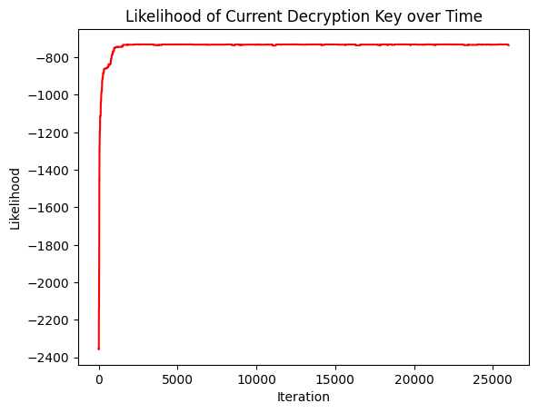

# Cipher Decoding

This notebook recreates a famous cryptography paper written by Coram and Beineke. I use the Metropolis-Hastings algorithm to crack a simple "substitution cipher." To encode a message with a substitution cipher, one simply swaps each letter of the real message with a corresponding code letter. For example, a substitution cipher might pick the letter 'd' to represent the letter 'a'. So, to encode the real message, one simply changes every 'a' in the real message to 'd'. To create a seemingly uncrackable code, you would swap every letter of the alphabet for another, not just 'a' to 'd'. To decode a message, one must recover the correct swaps between code and real letters--the key.

The algorithm recovers the key as follows. First, initialize a random key. Then propose a new key by changing two letters *in code space* uniformly at random (this is shown more clearly in the program below). The new key is accepted or rejected with a given probability consistent with the classic Metropolis-Hastings algorithm. Iterate the algorithm for a given number of steps, and in all likelihood, the algorithm has recovered the correct key, or something very close.

In order to use the Metropolis-Hastings algorithm, though, we need to know the likelihood of a message decoded with a guess to the correct key. We measure the likelihood of a key by assessing its consistency with some known rules of language--for example, how often the letter 'b' follows the letter 't'. I downloaded the book War and Peace and recorded exactly that for all letters. This yields a matrix of first order transition probabilities, i.e. how often each letter of the alphabet follows another.

At each iteration of the algorithm, we decode the cipher given our current guess to the key, and then multiply the corresponding transition probabilities together. The product measures the likelihood of the current key. The algorithm navigates the state space of substitution ciphers efficiently, finding the most likely ciphers given the observed coded message. We write a program to solve substitution ciphers and demonstrate an example of a coded and decoded message below (one of my favorite quotes about probability). 

    Coded message:  owcnhcnhqlmhqehf hergqdcomhtuqomnhrzquohkdqzrzcico hhcehaqjhwrnhfrjmhowmhsqdijhrhkmdempohfmpwrlcnfhhwmhwrnhrohimrnohpqlpmjmjhnqhfupwhoqhqudhcfkmdempohclomiimponhowrohclhqdjmdhoqhkdmjcpohicooimhkrdonhqehcohhhsmhlmmjhlqohnqigmhcllufmdrzimhjceemdmlocrihmturocqlnhhzuohprlhunmhjcpmhscowhercdhnuppmnnhh 
    
    Decoded message:  this is one of my favorite quotes about probability  if god has made the world a perfect mechanism  he has at least conceded so much to our imperfect intellects that in order to predict little parts of it   we need not solve innumerable differential equations  but can use dice with fair success  

    Iteration:  0 --- hlotmotmrwdmrfmjzmfiprxohdmsgrhdtminrghmexrninoaohzmmofmbrqmlitmjiqdmhldmkrxaqmimedxfduhmjduliwotjmmldmlitmihmadithmurwudqdqmtrmjgulmhrmrgxmojedxfduhmowhdaaduhtmhlihmowmrxqdxmhrmexdqouhmaohhadmeixhtmrfmohmmmkdmwddqmwrhmtrapdmowwgjdxinadmqoffdxdwhoiamdsgihorwtmmnghmuiwmgtdmqoudmkohlmfioxmtguudttmm 
    
    Iteration:  2000 --- this is one of my favorite quotes apout bropapility  if kod has made the world a berfect mechanism  he has at least conceded so much to our imberfect intellects that in order to bredict little barts of it   we need not solve innumeraple differential equations  put can use dice with fair success   
    
    Iteration:  4000 --- this is one of my favorite quotes agout progagility  if bod has made the world a perfect mechanism  he has at least conceded so much to our imperfect intellects that in order to predict little parts of it   we need not solve innumeragle differential equations  gut can use dice with fair success   
    
    Iteration:  6000 --- this is one of my fakorite quotes apout bropapility  if god has made the world a berfect mechanism  he has at least conceded so much to our imberfect intellects that in order to bredict little barts of it   we need not solke innumeraple differential equations  put can use dice with fair success   
    
    Iteration:  8000 --- this is one of my fakorite quotes apout bropapility  if jod has made the world a berfect mechanism  he has at least conceded so much to our imberfect intellects that in order to bredict little barts of it   we need not solke innumeraple differential equations  put can use dice with fair success   
    
    Iteration:  10000 --- this is one of my fakorite quotes about probability  if vod has made the world a perfect mechanism  he has at least conceded so much to our imperfect intellects that in order to predict little parts of it   we need not solke innumerable differential equations  but can use dice with fair success   
    
    Iteration:  12000 --- this is one of my favorite quotes about probability  if god has made the world a perfect mechanism  he has at least conceded so much to our imperfect intellects that in order to predict little parts of it   we need not solve innumerable differential equations  but can use dice with fair success   
    
    Iteration:  14000 --- this is one of my favorite quotes about probability  if jod has made the world a perfect mechanism  he has at least conceded so much to our imperfect intellects that in order to predict little parts of it   we need not solve innumerable differential equations  but can use dice with fair success   
    
    Iteration:  16000 --- this is one of my favorite quotes about probability  if god has made the world a perfect mechanism  he has at least conceded so much to our imperfect intellects that in order to predict little parts of it   we need not solve innumerable differential equations  but can use dice with fair success   
    
    Iteration:  18000 --- this is one of my favorite quotes about probability  if jod has made the world a perfect mechanism  he has at least conceded so much to our imperfect intellects that in order to predict little parts of it   we need not solve innumerable differential equations  but can use dice with fair success   
    
    Iteration:  20000 --- this is one of my favorite quotes apout bropapility  if god has made the world a berfect mechanism  he has at least conceded so much to our imberfect intellects that in order to bredict little barts of it   we need not solve innumeraple differential equations  put can use dice with fair success   
    
    Iteration:  22000 --- this is one of my favorite quotes about probability  if god has made the world a perfect mechanism  he has at least conceded so much to our imperfect intellects that in order to predict little parts of it   we need not solve innumerable differential equations  but can use dice with fair success   
    
    Iteration:  24000 --- this is one of my favorite juotes about probability  if god has made the world a perfect mechanism  he has at least conceded so much to our imperfect intellects that in order to predict little parts of it   we need not solve innumerable differential ejuations  but can use dice with fair success   
    

    Decoded with MCMC:  this is one of my favorite juotes about probability  if god has made the world a perfect mechanism  he has at least conceded so much to our imperfect intellects that in order to predict little parts of it   we need not solve innumerable differential ejuations  but can use dice with fair success  
    Known decoded message:  this is one of my favorite quotes about probability  if god has made the world a perfect mechanism  he has at least conceded so much to our imperfect intellects that in order to predict little parts of it   we need not solve innumerable differential equations  but can use dice with fair success  

We can see that the MCMC method has nearly perfectly decoded the substitution cipher. In fact, we see in the second to last printed iteration (iteration 22000) that it was decoded perfectly. We plot the likelihood of the current decoding function across iterations of the algorithm. The likelihood makes some large jumps at the start of the algorithm but then only makes minor changes to the decoding key. The decoded messages printed during the algorithm reflect this above. 
    

    

